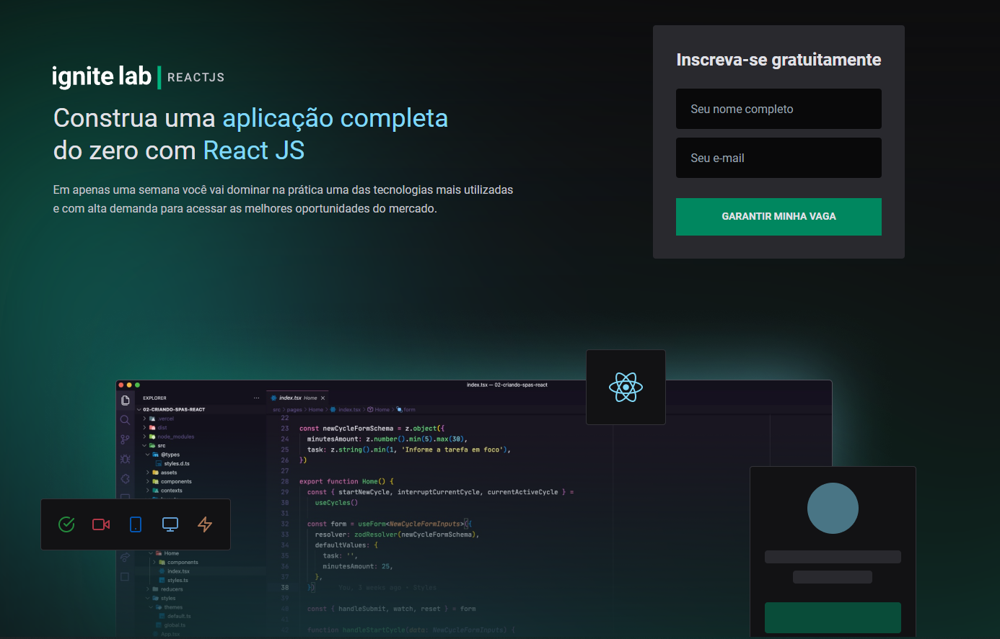
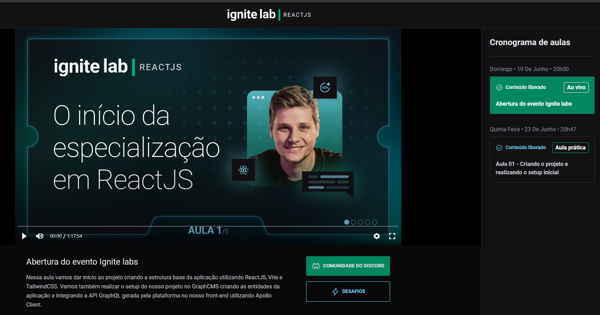

# Plataforma de evento

- O seguinte projeto foi desenvolvido na semana Ignite Lab 2, disponibilizado pela Rocketseat. 
Um evento imersivo de 1 semana dando entrada a especialização em Reactjs. 
A premissa do projeto é: Fornecer uma plataforma de eventos, onde é possivel adicionar aulas para os inscritos no evento assistirem.
Essas aulas terão caracteristicas como, um video para ele pertecente, um professor, descrição e um identificado que aqui chamaos de slug. 

# O que eu aprendi com esse projeto? 

- Toda edição de eventos desse nipe, aprendo muitas coisas novas, dessa vez não foi diferente. 
Tive meu primeiro contato com o Graphql e seu ecosistema, com isso conseguir aprender como ele funciona usando somente query e mutation, que é algo bem diferente do que estou acostumada utilizadno apis rest.
Não conhecia também, o conceito de headlessCMS, que aprendi que é um cms que não tem um frontend diretamente conectado a ela, como o wordpress por exemplo. Esse headlesscms que usamos nos permite usar qualquer tecnologia no front pois nos entrega os dados via api, que nesse caso era uma api graphql. Isso eu achei uma mão na roda!

Inclusive, conversando com profissionais mais experientes que eu, recebi um aviso pra quando usar Graphql dar bastante atenção a parte de segurança da api/aplicação.

# Projeto (Vercerl Delploy)
<a href="https://ignitelab-eventplatform-o5fk7lr16-rebeccaaaaaaaaaaa.vercel.app/" target="_blank" alt="live projeto"> Ver o projeto em live</a>

# Preview

# Figma do Projeto

<a href="https://www.figma.com/community/file/1120711251998877938" alt=""> Layout do projeto no Figma <a>

# Como executar clonar e executar o projeto

- Para colonar o projeto no terminarl digite

    - git clone https://github.com/rebeccaaaaaaaaaaa/ignitelab-eventplatform.git

- Entre na pasta do projeto e instale as dependencias
    - cd ignitelab-eventplatform
    - npm install 

- Pegar as chaves da api e token no GraphCMS
    - Clonar o projeto pelo GraphCMS - (voce vaiprecisar criar uma conta)<a href="https://app.graphcms.com/clone/6868861bc5024fdca04b1c523b347363?name=ignitelab-rebeccaig"> clique aqui para clonar o projeto <a>

    - Pegar api 
     - Depois de criar sua conta e clonar o projeto vá para Settings/API Access/Endpoints, o endpoint que voce vai precisar estár em CONTENT API (url finalizada com /master)

     - Toker de autenticação
        - Para pegar o token de atutenticação, vá para Settings/API Access/Permanent Auth Tokens, se voce clonou meu projeto, provavelmente já está com um criado, porém voce pode apagar e criar um novo.

- Criando e adicionando a api e token em variavéis de ambiente
    - Ao ter em mãos o endpoint da api e o token de atutenticação, crie na raiz do projeto um arquivo .evn.local com o seguinte conteúdo: 
        - VITE_API_URL="seu_endpoint_aqui"
        - VITE_API_ACCESS_TOKEN="seu_token_aqui"

- Adicionar o .env.local no .gitignore
    - Adicione dentro do .gitignore o .env.local

- Para rodar o projeto digite
    - npm run dev

# Tecnologias 

- Reactjs
- Vite
- Graphql
- Apollo
- GraphCMS
- CodeGen
- Tailwind
- Vime
- Phosphor React
- React Router Dom
- TyperScript

# O que são essas tecnologias?

- Reactjs - React faz com que a criação de UIs interativas seja uma tarefa fácil. Crie views simples para cada estado na sua aplicação, e o React irá atualizar e renderizar de forma eficiente apenas os componentes necessários na medida em que os dados mudam. <a href="https://pt-br.reactjs.org/" alt="ir para o site oficial do REACTJS"> Saber mais<a>

- Vite - é uma ferramenta de construção que visa fornecer uma experiência de desenvolvimento mais rápida e enxuta para projetos web modernos. É composto por duas partes principais:
 1 - Um servidor de desenvolvimento que fornece aprimoramentos de recursos avançados em módulos ES nativos , por exemplo, Hot Module Replacement (HMR) extremamente rápido .
 2 - Um comando de compilação que agrupa seu código com Rollup , pré-configurado para gerar ativos estáticos altamente otimizados para produção. <a href="https://vitejs.dev/guide/" alt="ir para o site oficial"> Saber mais<a>

- Graphql -  GraphQL é uma linguagem de consulta para APIs e um tempo de execução para atender a essas consultas com seus dados existentes. O GraphQL fornece uma descrição completa e compreensível dos dados em sua API, oferece aos clientes o poder de solicitar exatamente o que eles precisam e nada mais, facilita a evolução de APIs ao longo do tempo e permite ferramentas de desenvolvedor poderosas. <a href="https://graphql.org/" alt="ir para o site oficial"> Saber mais<a>

- Apollo - O Apollo rastreia seus esquemas GraphQL em um registro para criar uma fonte central de verdade para tudo em seu supergrafo.  <a href="https://www.apollographql.com/" alt="ir para o site oficial"> Saber mais<a>

- GraphCMS - O GraphCMS oferece APIs de conteúdo GraphQL instantâneas para criar, enriquecer, unificar e entregar seu conteúdo entre plataformas. <a href="https://graphcms.com/" alt="ir para o site oficial"> Saber mais<a>

- CodeGen -  Gerador de código do seu esquema GraphQL. Consegue gerar código de seu esquema e operações do GraphQL com uma CLI simples<a href="https://www.graphql-code-generator.com/" alt="ir para o site oficial"> Saber mais<a>

- Tailwind - Uma estrutura CSS de utilidade em primeiro lugar com classes como , , e que podem ser compostas para construir qualquer design, diretamente em sua marcação. <a href="https://tailwindcss.com/" alt="ir para o site oficial"> Saber mais<a>

- Phosphor React - Phosphor é uma família de ícones flexível para interfaces, diagramas, apresentações <a href="https://phosphoricons.com/" alt="ir para o site oficial"> Saber mais<a>

- React Router Dom -  O React Router v6 leva os melhores recursos das versões anteriores - e seu projeto irmão, Reach Router - em nosso menor e mais poderoso pacote até agora. <a href="https://reactrouter.com/" alt="ir para o site oficial"> Saber mais<a>

- TyperScript - O TypeScript adiciona sintaxe adicional ao JavaScript para oferecer suporte a uma integração mais estreita com seu editor . Detecte erros no início do seu editor. <a href="https://www.typescriptlang.org/" alt="ir para o site oficial"> Saber mais<a>

